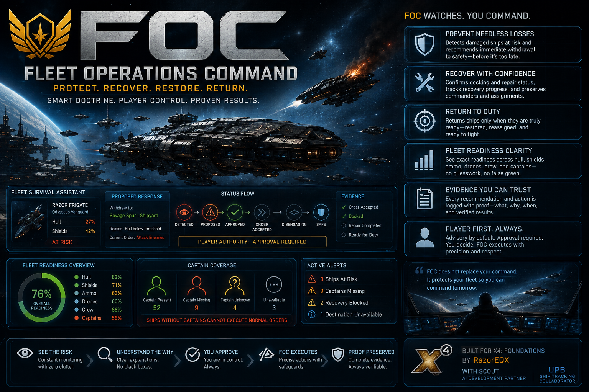

# Fleet Operations Command



**Protect. Recover. Restore. Return.**

Fleet Operations Command (FOC) is a player-first fleet readiness, patrol, recovery, training, and distress-response console for **X4: Foundations**. It turns large-empire fleet management into clear, bounded decisions while keeping the player in command.

[](https://steamcommunity.com/sharedfiles/filedetails/?id=3793624775)


## Current release

- Public version: **1.49**
- Governed runtime identity: **Build 050 / extension version 149**
- Release archive: [`dist/FOC_v149_GA.zip`](dist/FOC_v149_GA.zip)
- Release SHA-256: `9CF991A08DEB30CE27993EC293206602151C5DC1490C17B82A7AE9DC3A2A073B`
- Complete player guide: [`docs/FOC_v1.49_COMPLETE_PLAYER_GUIDE.pdf`](docs/FOC_v1.49_COMPLETE_PLAYER_GUIDE.pdf)
- Browser-readable player guide: [`docs/PLAYER_GUIDE.md`](docs/PLAYER_GUIDE.md)
- Steam Workshop: [Fleet Operations Command](https://steamcommunity.com/sharedfiles/filedetails/?id=3793624775)

This repository contains the same seven runtime files as the tested and accepted GA release. Publication files, documentation, and artwork are outside the installable `jk_foc` folder.

## Features

- **One-button patrol deployment** — configure a complete plan and send only the selected fleet.
- **Named task forces** — group save-backed fleet identities into active/reserve defense teams without changing X4's native fleet hierarchy.
- **Plans, templates, and presets** — save fleet drafts, reuse plans, and preview every consequential action before sending orders.
- **Structural fleet discovery** — finds eligible combat fleets from X4's live commander hierarchy instead of names, old markers, or a partial faction-ship sample.
- **Alphabetical fleet finder** — narrows large fleet lists without changing the underlying structural discovery rules.
- **Focused patrol controls** — choose Home, distress-response range, distress classes, urgency, hull thresholds, and return behavior.
- **Dedicated Historical Intelligence Map** — inspect player-discovered sectors without leaving FOC, hover cells for retained fleet/risk/Home evidence, and navigate with native pan, rotate, and zoom controls.
- **Exact FOC location marking** — choose a Fleet Home or another FOC-requested point directly on the dedicated map; cancelling sends no order.
- **Evidence-based route filters** — view Pirate Activity and Heavy Patrol Routes with yellow, amber, and red evidence intensity independent of faction ownership.
- **Native X4 orders** — uses Patrol, Protect Position, and Attack orders with native readback before reporting success.
- **Native fleet maintenance** — opens X4's repair screen and preserves exact blueprint/loadout evidence for guarded replacement and player-yard rebuild requests.
- **Bounded distress response** — reacts to fresh attacks while enforcing range, readiness, ownership, lock, mission, manual-order, and identity safeguards.
- **Fleet readiness clarity** — separates proven captain vacancies from unknown evidence.
- **Pilot and Marine Academy** — maintains a bounded shared roster, uses native seminars, supports exact assignments and captain auto-fill, and includes an approval-driven Academy Store.
- **Clear story-ship control** — protects unknown ships and asks a saved, exact-ship Yes-or-No question when X4 still marks a ship after its story is finished.
- **Preview before action** — evaluates response, staffing, purchase, and rebuild eligibility before mutation.
- **Evidence-preserving activity** — reports what was requested, accepted, blocked, and returned by X4.
- **Pinned action feedback and workflow pointers** — keeps the last result visible while optional arrows identify the next real step.
- **Large-empire bounds** — capped sampling, bounded results, duplicate suppression, and a single 30-second automation scheduler.

## Player authority

FOC is advisory and approval-driven by default. Full Automation is an explicit mode and uses the same safety gates as manual dispatch.

FOC does not take control from the player, replace existing captains without approval, move cargo, buy ship blueprints, create free repairs, or treat uncertain evidence as safe. Academy purchases, native repairs, and fleet rebuilds remain visible, bounded, and player-approved. Player-piloted ships and current story or mission ships remain protected unless the player gives FOC a clear answer for that exact ship after its story is finished.

## Installation

### Steam Workshop

Subscribe on the [Steam Workshop](https://steamcommunity.com/sharedfiles/filedetails/?id=3793624775), allow Steam to download the extension, then enable **Fleet Operations Command** in X4's Extensions menu if needed.

### Manual installation

1. Close X4: Foundations.
2. Download [`FOC_v149_GA.zip`](dist/FOC_v149_GA.zip).
3. Extract the lowercase `jk_foc` folder into the game's `extensions` directory.
4. Confirm the final path ends with `X4 Foundations/extensions/jk_foc/content.xml`.
5. Start X4 and enable Fleet Operations Command if needed.

See [Installation and updates](docs/INSTALLATION.md) for more detail.

## Quick start

1. Open Fleet Operations Command from the in-game interface.
2. Select **Fleets** and choose a player-owned combat fleet.
3. Choose its exact Home point on the dedicated FOC Historical Intelligence Map.
4. Configure distress-response range, distress rules, thresholds, and return behavior.
5. Review the summary, then select **Send This Fleet on Patrol**.
6. Check **Activity** for native order readback or a precise blocker.

Open **Operations Map** to hover discovered sectors and inspect retained intelligence. Select **Pirate Activity** or **Heavy Patrol Routes** to color qualifying route evidence; neutral routes mean no qualifying retained report, not proven safety.

See the [Quick-start guide](docs/QUICK_START.md).

## Repository layout

```text
jk_foc/       Installable X4 extension source
dist/         Exact GA installation archive
assets/       Project artwork
docs/         Public installation and operator documentation
```

## Support

When reporting a problem, include:

- the visible FOC result or blocker;
- the affected fleet and action;
- what you expected to happen;
- whether another mod recently changed the affected ship; and
- the relevant portion of the X4 debug log.

Use the repository's [Issues](https://github.com/razoreqx1/FOC/issues) page after checking for an existing report.

## Credits

- Created by **RazorEQX**
- Development support: **Scout AI Development Partner**
- Ship-tracking collaboration: **UPB**

Fleet Operations Command is an independent community extension for X4: Foundations and is not affiliated with or endorsed by Egosoft.

## Rights

Copyright © 2026 RazorEQX. No open-source license has been granted. The source is publicly viewable, but reuse, redistribution, or derivative publication requires permission from the copyright holder.
