# Fleet Operations Command v1.55 - Complete Player Guide

**Applies to:** Fleet Operations Command v1.54, Build 056

**Game:** X4: Foundations

**Purpose:** Help a new player find fleets, inspect historical sector intelligence, mark exact Fleet Homes, start patrols, answer distress calls, train Pilots and Marines, maintain damaged or lost ships, and understand every FOC page without guessing.

FOC is designed to be safe. It explains what it found, what it plans to do, and why an action was allowed or blocked. You stay in command.

Older reference screenshots may show an earlier build number. These are genuine captures with their original build labels; they illustrate menu layout, not a guarantee of gameplay outcomes. The text in this guide is current for Build 056, including the dedicated FOC Historical Intelligence Map introduced in v1.49 and the Strategic Ops additions in v1.54.

---

## 1. What FOC does

Fleet Operations Command is a fleet patrol, readiness, recovery, training, intelligence, and response console. It helps answer eight questions:

1. Which player combat fleets exist right now?
2. Which fleets are ready to receive orders?
3. Which ships need captains?
4. Where should each fleet use as Home?
5. Which distress calls should a fleet answer?
6. Which damaged or lost fleet ships need attention?
7. Did X4 actually accept the requested action?
8. What has FOC actually observed in each discovered sector and along recent routes?

FOC uses X4's live commander hierarchy instead of trusting fleet names or old markers. It can start native patrols, help staff ships, hand damaged ships to X4's native Repair / Upgrade screen, preserve exact lost-ship records, request guarded rebuilds, and send one eligible response fleet to a fresh attack.

### What FOC does not do silently

- It does not take control from the player.
- It does not replace an existing captain without approval.
- It does not control the ship you are personally flying.
- It does not move cargo or buy ship blueprints.
- It does not create free repairs or free replacement ships.
- It does not spend Academy or rebuild resources without a visible player-approved action.
- It does not change X4's story or mission state.
- It does not treat missing information as safe.

### Four words you should know

- **UNKNOWN** means FOC could not prove the information. It does not mean everything is fine.
- **BLOCKED** means a safety check stopped the action. Nothing changed.
- **PENDING** means FOC sent a request and is waiting for X4 to report back.
- **ACTIVE / CONFIRMED** means X4 returned the expected order or state.

> **Simple rule:** If you are unsure, stop clicking and read the orange, red, or green result line. Then open **ACTIVITY**.

---

## 2. Install, update, or remove FOC

### Steam Workshop

1. Subscribe to [Fleet Operations Command on Steam](https://steamcommunity.com/sharedfiles/filedetails/?id=3793624775).
2. Let Steam finish downloading it.
3. Start X4.
4. Open **Extensions** and make sure Fleet Operations Command is enabled.

### Manual installation

1. Close X4 normally.
2. Extract the `jk_foc` folder into the X4 `extensions` folder.
3. Check that the final path ends like this:

   `X4 Foundations/extensions/jk_foc/content.xml`

Do not place `jk_foc` inside a second `jk_foc` folder. Do not mix files from different versions.

### Updating

Steam updates the Workshop copy automatically. For a manual copy, close X4, preserve the previous folder if you want a rollback copy, and replace the complete `jk_foc` folder.

Existing-save initialization preserves valid FOC plans, recovery records, Academy state, exact story-ship answers, Task Forces, templates, reports, operations policy, pirate observations, and enrolled-fleet patrol traversals from existing saves. The migration repairs or discards malformed records conservatively. Missing evidence remains blocked instead of being guessed.

### Removing

Close X4, unsubscribe on Steam or remove the manual `jk_foc` folder, then start X4 again. FOC does not add custom ships, sectors, stations, or wares required for a save to load.

---

## 3. Open FOC and learn the screen

1. Load your save.
2. Dock at a station or ship.
3. Open the normal docked interaction menu.
4. Select **OPEN FLEET OPERATIONS COMMAND**.
5. Wait for the bounded inventory snapshot to finish.

The top bar has ten tabs:

1. **COMMAND** - fleet status, global authority, plan controls, and emergency stop.
2. **FLEETS** - fleet selection, Home, patrol, distress rules, story protection, and maintenance.
3. **STRATEGIC OPS** - Workspace dropdown for Task Forces, Carrier Air Wings, Sector Defense Grid, Convoy Escort, Mobile Logistics, and Coordinated Assault.
4. **READINESS** - captain coverage, proven vacancies, and unknown evidence.
5. **TRAINING ACADEMY** - Pilot and Marine trainees, seminars, assignments, and captain auto-fill.
6. **ACADEMY STORE** - approved training-supply purchases and inventory results.
7. **FLEET RESPONSE** - current incidents and eligible dispatch.
8. **ACTIVITY** - requests, blockers, native readback, and recent history.
9. **OPERATIONS MAP** - historical sector intelligence, saved Homes, fleet presence, readiness, and evidence-based route filters.
10. **SETTINGS** - persistent authority, readiness, retreat, templates, and presets.

Use **REFRESH** when you want a new bounded snapshot. A refresh does not send orders.

### Workflow pointers and action feedback

FOC can place `->` on every currently available next step in a real workflow. Several arrows can appear when more than one safe choice is available. Select **CLEAR NEXT-STEP POINTERS** in the pinned top bar when you no longer need the hints; select **SHOW NEXT-STEP POINTERS** to restore them.

Every real action also produces a pinned **LAST ACTION** message beneath the tabs. Green confirms a completed or matched result. Orange explains a warning, blocker, preview requirement, or pending action. The message remains visible while you scroll so you do not have to hunt for proof that a button responded.

### Color language

- **Blue/cyan:** navigation, selection, or an editable control.
- **Green:** verified, accepted, ready, or active.
- **Orange/amber:** warning, preview, approval, or action needed.
- **Red:** a proven failure, damage event, or missing safety requirement.
- **Gray:** neutral information or an unavailable control.

---

## 4. Your first 10 minutes

Use this safe setup the first time:

1. Open **SETTINGS**.
2. Keep **Master mode** on **PREVIEW PLAN**.
3. Press **REFRESH** once.
4. Open **COMMAND** and confirm the fleet count looks reasonable.
5. Open **READINESS** and check for ships marked **MISSING**.
6. Open **FLEETS** and select one normal player combat fleet.
7. Choose a Home point on the dedicated FOC map.
8. Set distress-response options.
9. Read the summary: Home, Fleet Order, Distress Call, and Return.
10. Press **SEND THIS FLEET ON PATROL - REPLACES CURRENT ORDERS**.
11. Wait for **PATROL ACTIVE - DISTRESS RESPONSE ARMED**.
12. Open **ACTIVITY** and read the returned result.

You do not need global Apply to start one fleet. The main button on **FLEETS** handles only the selected fleet.

---

## 5. COMMAND - understand the whole force

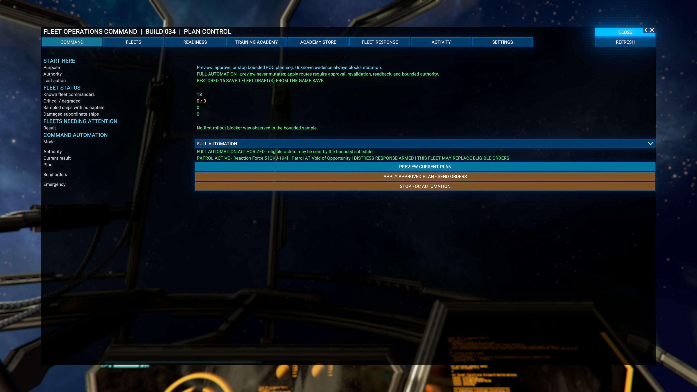

### What this page does

Command shows the number of known fleet commanders, proven problems, the active authority mode, the latest result, and global plan controls.

### The three authority modes

- **PREVIEW PLAN** - safest mode. FOC can explain plans but does not run the global Apply action.
- **APPLY APPROVED PLAN** - allows the player to approve eligible saved and unlocked fleet orders from Command.
- **FULL AUTOMATION** - allows the bounded scheduler to send one eligible distress response per cycle.

Changing the mode does not apply a plan by itself.

### Global Apply

1. Select **PREVIEW CURRENT PLAN**.
2. Read the counts and blockers.
3. Choose **APPLY APPROVED PLAN**.
4. Select **APPLY APPROVED PLAN - SEND ORDERS**.
5. Wait for readback.
6. Open **ACTIVITY** and check every active, blocked, inactive, and locked-skipped result.

For normal play, use the selected-fleet button on **FLEETS**. It is easier to understand and affects a smaller scope.

### Emergency stop

Select **STOP FOC AUTOMATION** to return to Preview Plan and stop background response dispatch. It does not erase saved fleet settings or cancel unrelated X4 orders.

---

## 6. FLEETS - find, configure, and send one fleet

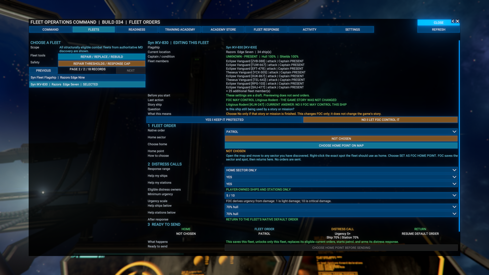

### Structural discovery and the fleet finder

FOC now discovers player-owned top-level combat commanders and their living ship subordinates from X4's actual hierarchy. A fleet name, Reaction Force label, or old saved marker does not create membership.

Station guards, station-commanded ships, non-combat commanders, and cargo or mining fleets are excluded from the normal combat list. Use the alphabetical **FLEET FINDER** to narrow the list, then use the page arrows when more matching fleets exist than fit on one page.

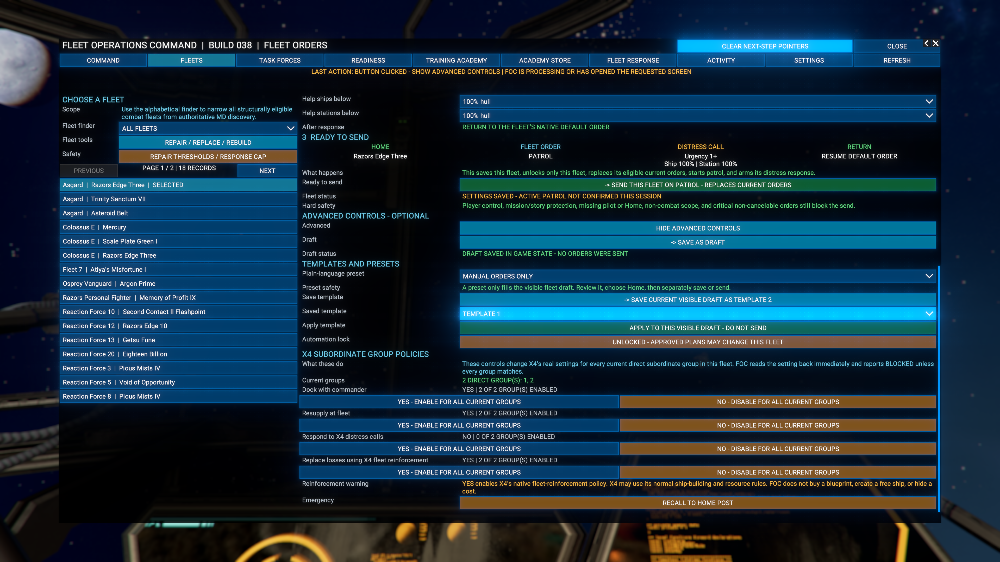

### Step 1 - Choose a fleet

1. Pick a fleet from the list on the left.
2. Make sure the row says **SELECTED**.
3. Check the flagship, location, captain, hull, shields, and visible members.
4. Read any red or orange protection message before changing an order.

### Step 2 - Answer a story-ship question carefully

If X4 still marks one ship as protected, FOC asks:

**Is this ship still being used by a story or mission?**

- Choose **YES - KEEP IT PROTECTED** while the ship is still needed by a story or mission.
- Choose **NO - LET FOC CONTROL IT** only after that story or mission is finished.

The answer applies only to the named ship and is saved with its stable ship ID. It changes FOC's protection only. It never changes X4's story, mission, rewards, or completion state.

After you answer, the question and both buttons disappear. FOC automatically releases the exact player-owned Yaki cover ship only when X4 positively reports that its owning story is complete. Unknown ships stay protected.

### Step 3 - Choose Home

1. Select **CHOOSE HOME POINT ON MAP**.
2. FOC opens its dedicated Historical Intelligence Map in location-marking mode.
3. Pan or zoom to a player-discovered sector.
4. Left-click the exact point the fleet should use as Home. A drag pans; it does not select a point.
5. FOC returns to the fleet draft. Confirm the sector and exact X, Y, and Z coordinates before sending.

Press **Escape** or **BACK TO FOC** to cancel without changing the Home point. Choosing Home changes only the unsaved fleet draft and sends no order.

### Step 4 - Set the fleet order and distress rules

Choose:

- the native fleet order: **Patrol** or **Guard Home**;
- distress-response range;
- whether to help player ships;
- whether to help player stations;
- minimum urgency from 1 to 10;
- ship hull threshold;
- station hull threshold; and
- whether to resume the fleet's native default order afterward.

Urgency 1 is light damage. Urgency 10 is critical damage. Response range limits which distress calls are eligible; it does not create a custom patrol route.

### Step 5 - Send the fleet

Read the summary, then select:

**SEND THIS FLEET ON PATROL - REPLACES CURRENT ORDERS**

This action saves the selected fleet, unlocks only that fleet, replaces only eligible current orders, starts its native default order, and arms its distress response.

FOC reports **PATROL ACTIVE** only after X4 returns the intended current and default order. Player control, missing captain, missing Home, current story protection, non-combat scope, or a critical non-cancelable order still blocks the send.

---

## 7. OPERATIONS MAP - historical intelligence and exact locations

The **OPERATIONS MAP** tab opens FOC's dedicated full-screen Historical Intelligence Map. It is not the ordinary X4 map. It uses X4's native holomap navigation while keeping FOC's own intelligence panel and location-marking workflow.

### Navigate the map

- Move the pointer over a known sector cell to update the intelligence panel.
- Left-drag to pan.
- Right-drag to rotate.
- Use the mouse wheel to zoom.
- Select **RESET VIEW** to return to the discovered-universe view.
- Select **BACK TO FOC** or press **Escape** to leave the map safely.

A short click selects a known sector while browsing. When FOC opened the map to mark a Fleet Home or another request-scoped location, a short left-click chooses the exact point and returns it to the requesting FOC workflow. Dragging still pans, and cancelling sends no order.

### Read sector intelligence

The panel describes the sector currently under the pointer, or the selected sector when no hover target is active. Depending on retained evidence it can show:

- **Risk** - FOC's bounded evidence score and its Quiet, Elevated, High, or Critical label;
- **Fleet presence** - observed enrolled fleets in that sector;
- **Saved Homes** - fleet Home locations saved there;
- **Readiness** - counts of fleets with critical or degraded evidence;
- **Filter evidence** - pirate observations or enrolled-fleet gate traversals within the selected observation window; and
- **Unlocated** - threat observations that FOC could not safely place on a known sector.

**NO FOC SECTOR EVIDENCE** means FOC has no retained record for that sector. It does not prove that the sector is safe. FOC shows only player-discovered space and hides civilian ships, order queues, trade offers, and resource overlays to keep the intelligence view focused.

### Use the analysis filter

- **OVERVIEW** keeps routes neutral and emphasizes the hovered sector's general FOC evidence.
- **PIRATE ACTIVITY** uses retained attacks on player-owned assets where X4 positively identified the attacker's true owner as a pirate faction.
- **HEAVY PATROL ROUTES** uses observed adjacent-gate crossings by enrolled FOC fleet commanders. FOC samples commander sectors every 30 seconds; it does not infer a crossing between non-adjacent sectors.

Filtered route strokes are FOC analysis colors, not faction ownership: yellow is lower retained evidence, amber is stronger evidence, and red is the hottest retained evidence. Native gate lines remain visible and neutral. The filter does not predict future danger, reveal undiscovered space, or send an order.

FOC retains at most 200 valid pirate observations and 250 valid patrol traversals. The default analysis window is 60 minutes. A route appears only when retained evidence falls inside the active window, so an unchanged neutral line means **no qualifying report**, not **proven safe**.

---

## 8. STRATEGIC OPS - Task Forces and linked workspaces

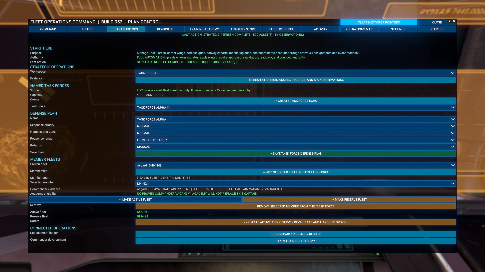

Task Forces are named FOC groups for coordinating existing X4 fleets. They do not merge ships, move subordinates, or replace X4's native fleet hierarchy. FOC stores at most eight Task Forces, and one fleet can belong to only one Task Force.

### Create a Task Force

1. Open **STRATEGIC OPS** and select **TASK FORCES** in the Workspace dropdown.
2. Select **CREATE TASK FORCE** for the next available named group.
3. Select that Task Force and choose its name and defense-plan settings.
4. Choose response priority, Home-sector zone, response range, and rotation mode.
5. Select **SAVE TASK FORCE DEFENSE PLAN**.
6. Read the result before assigning fleets.

An **EXCLUDED** zone tells FOC not to use that Task Force for incidents in its saved Home sector. A **HIGH** zone raises it ahead of normal-zone choices when every other safety check passes. Zone and priority settings never override ownership, story protection, readiness, distance, or locks.

### Add fleets and choose roles

1. Select the Task Force.
2. Select an unassigned fleet and choose **ADD FLEET**.
3. Repeat for each intended member.
4. Select one member as **ACTIVE**.
5. Select a different member as **RESERVE**.
6. Save the Task Force.

The page shows the selected member's current commander, captain, and hull evidence. If FOC cannot prove a required fact, rotation stays blocked.

### Rotate active and reserve fleets

For a manual rotation, preview the saved pair and select **ROTATE ACTIVE / RESERVE**. FOC revalidates both fleets, their Home points, ownership, captains, story protection, player control, critical orders, fleet size, and saved readiness policy. It then returns the old active fleet to its saved post, activates the reserve fleet's saved native order, reads both orders back, and swaps the roles only after confirmation.

If either order fails readback, FOC attempts to restore the exact pre-rotation orders. The result says whether rollback was **CONFIRMED** or **UNKNOWN**. Never assume an UNKNOWN rollback restored the fleets; check both commanders on the X4 map.

In **FULL AUTOMATION**, rotation shares FOC's existing 30-second one-mutation boundary. It runs only when no distress dispatch was made in that cycle and the active fleet fails the saved readiness rule. It never rotates merely because a stronger fleet exists.

### Remove or delete safely

Removing a fleet from a Task Force changes only FOC's grouping. Deleting a Task Force does not delete ships or X4 fleets. Always read the visible result because active or reserve references must be cleared consistently.

---

## 8A. CARRIER AIR WINGS - configure the selected carrier

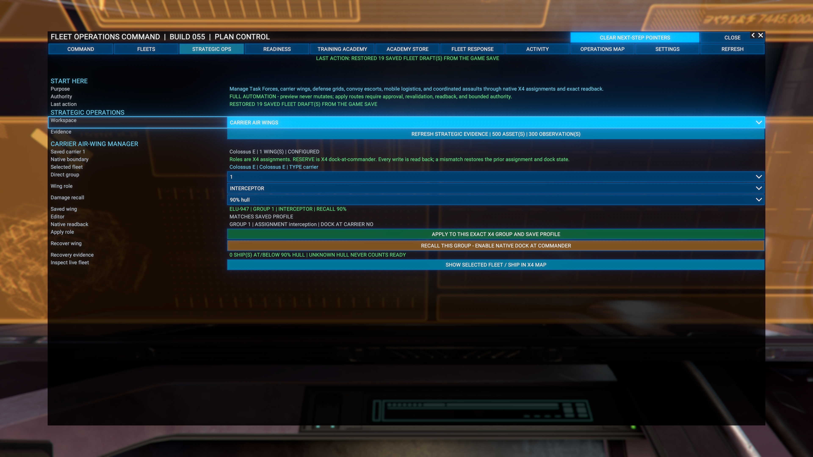

Open **FLEETS**, select the carrier, then open **STRATEGIC OPS** and choose **CARRIER AIR WINGS** from **Workspace**. The commander must be an X4 carrier with at least one direct subordinate group. A battleship such as an Asgard is not a carrier for this page.

1. Confirm the selected fleet and **Direct group**.
2. Read **Saved wing**: this is the stored carrier ID, group, role, and damage-recall threshold.
3. Choose the role and threshold in the editable dropdowns.
4. Read **Editor** to distinguish an unsaved change from a matching saved profile.
5. Select **APPLY TO THIS EXACT X4 GROUP AND SAVE PROFILE** when you want the native assignment changed and the profile saved.
6. Check the returned result and **Native readback**. Save the game normally to retain the resulting state in that save.

The roles map to native X4 group assignments:

- **INTERCEPTOR**: interception.
- **BOMBER**: bombardment.
- **ESCORT**: defence.
- **RESERVE**: defence with dock-at-commander enabled. A saved ready reserve can be launched by FOC's carrier combat-response logic; this is not a permanent stay-docked lock.

Changing a dropdown alone does not save the profile. For example, an editable 80% threshold beside **Saved wing: RECALL 90%** means the active saved setting is still 90%. Refresh and navigation retain the keyed draft during the session. A fresh load reads saved settings for the exact carrier and group. Two ships with the same name do not share a profile.

**RECALL THIS GROUP - ENABLE NATIVE DOCK AT COMMANDER** requests the Reserve profile for that group; it is a consequential action, not a preview. The saved damage threshold is used when an attacked wing member reaches that hull percentage or lower. Raising the threshold does not damage a ship or itself prove that a recall occurred. The Recovery evidence count is a sampled fleet-member hull count, not proof of selected-group docking or repair.

FOC distinguishes a requested recall from native readback and physical recovery. A hull-and-docking recovery result requires the group's members to be docked at the carrier with full hull. It does not prove ammunition or equipment replenishment, and does not by itself automatically relaunch the recovered group.

### Inspect the live fleet without applying the draft

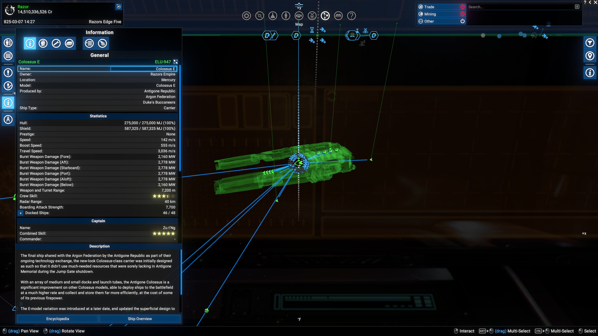

Use **SHOW SELECTED FLEET / SHIP IN X4 MAP** at the bottom of Carrier Air Wings. This opens the ordinary live X4 map on the selected commander; opening it does not Apply or send orders. Normal X4 map actions remain available, so orders you manually issue there are real orders.

Use Back to return to FOC, then compare **Saved wing**, **Editor**, and **Native readback**. Location marking for Home, rally points, and assault targets still uses the dedicated FOC map, not this inspection button.

---

## 8B. SECTOR DEFENSE GRID - coordinate saved posts

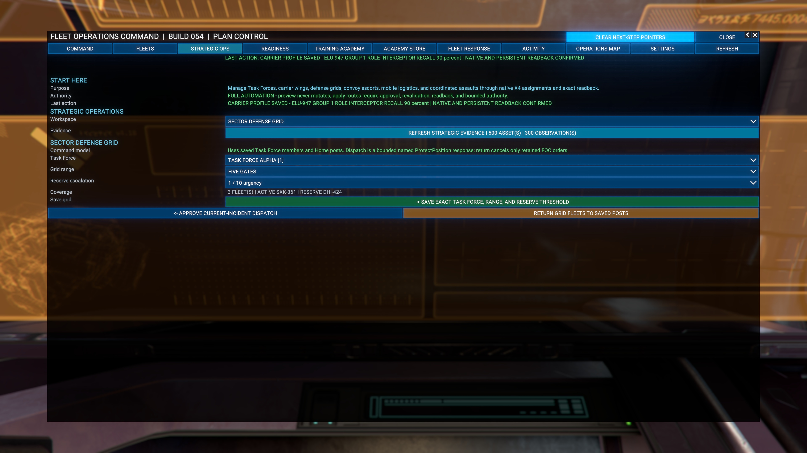

Choose **STRATEGIC OPS -> Workspace -> SECTOR DEFENSE GRID**. Create a Task Force and set member Homes first.

1. Select the Task Force.
2. Set **Grid range** and **Reserve escalation** urgency.
3. Check Coverage, including the active and reserve fleet IDs.
4. Select **SAVE EXACT TASK FORCE, RANGE, AND RESERVE THRESHOLD**.
5. Use **APPROVE CURRENT-INCIDENT DISPATCH** only when you intend to send eligible fleets to a current incident.
6. Use **RETURN GRID FLEETS TO SAVED POSTS** to request return from retained FOC grid orders.

Saving the grid is separate from dispatching it. Dispatch uses named native Protect Position orders. Return targets retained FOC orders rather than indiscriminately cancelling every fleet order. Read the result and inspect actual fleet movement.

---

## 8C. CONVOY ESCORT - protect a civilian ship

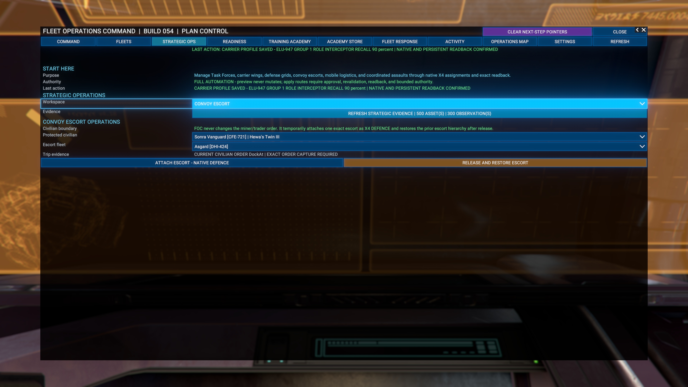

Choose **STRATEGIC OPS -> Workspace -> CONVOY ESCORT**.

1. Refresh strategic evidence if the miner, trader, or escort is absent.
2. Select **Protected civilian** and **Escort fleet**, checking both identity codes.
3. Read **Trip evidence** for the civilian's current order.
4. Select **ATTACH ESCORT - NATIVE DEFENCE** to request the temporary native defence assignment.
5. Read the result before leaving the page.
6. Select **RELEASE AND RESTORE ESCORT** when you want to release the retained assignment and restore its prior hierarchy.

FOC does not replace the miner or trader's order. The escort assignment changes native hierarchy temporarily, so choose the escort deliberately. Selection and Refresh alone do not attach it. A missing current civilian order blocks attachment.

---

## 8D. MOBILE LOGISTICS - assign an auxiliary

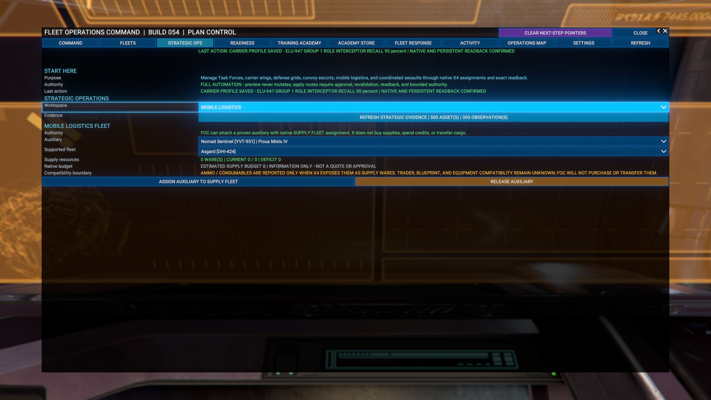

Choose **STRATEGIC OPS -> Workspace -> MOBILE LOGISTICS**.

1. Select an eligible **Auxiliary** and the **Supported fleet**.
2. Inspect the native supply-ware counts, deficits, and estimated budget.
3. Select **ASSIGN AUXILIARY TO SUPPLY FLEET** to request X4's native supply-fleet assignment.
4. Read the assignment result and inspect the ships in X4.
5. Use **RELEASE AUXILIARY** to request release of the retained assignment.

The budget is information, not a quote or spending approval. FOC does not purchase supplies, transfer cargo, buy blueprints, or equip ships from this page. A zero-ware/zero-deficit display is not proof that every ship has all ammunition or consumables. X4 supplies and compatibility still govern actual replenishment.

---

## 8E. COORDINATED ASSAULT - plan, rally, and launch

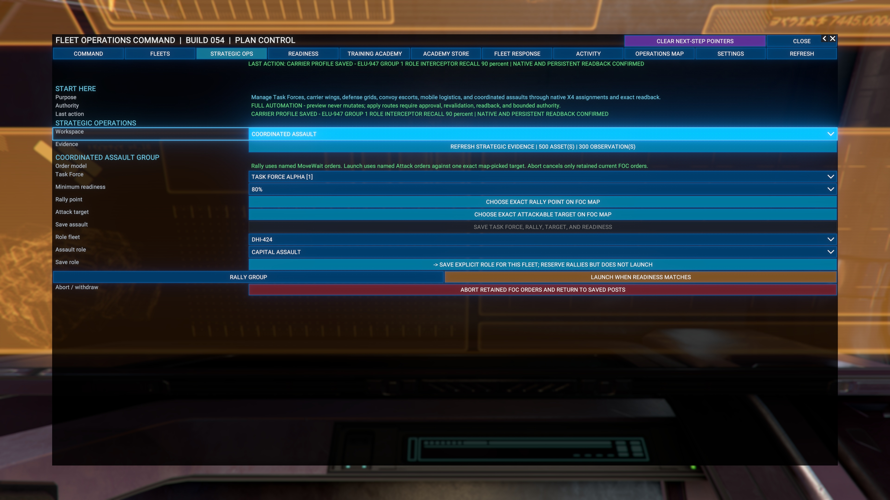

Choose **STRATEGIC OPS -> Workspace -> COORDINATED ASSAULT**.

1. Select a Task Force and **Minimum readiness**.
2. Select **CHOOSE EXACT RALLY POINT ON FOC MAP** and mark the intended point.
3. Select **CHOOSE EXACT ATTACKABLE TARGET ON FOC MAP** and choose the intended object.
4. Confirm the returned point and target, then **SAVE TASK FORCE, RALLY, TARGET, AND READINESS**.
5. For each member, select **Role fleet**, choose INTERCEPT, BOMBARDMENT, CAPITAL ASSAULT, or RESERVE, and save its explicit role.
6. Select **RALLY GROUP** when you intend to move the group.
7. Select **LAUNCH WHEN READINESS MATCHES** when you intend to attack.
8. Use **ABORT RETAINED FOC ORDERS AND RETURN TO SAVED POSTS** to request withdrawal from retained FOC assault orders.

Map selection and saving a plan are separate from issuing orders. Rally uses named Move and Wait orders; Launch uses named Attack orders against the selected target. Reserve-role members rally but do not launch with the assault. Readiness, identity, ownership, and safety checks still apply. Abort addresses only retained current FOC orders; verify the resulting fleet state in X4.

---

## 9. Repair, replace, or rebuild fleet ships

Open **FLEETS**, then choose **REPAIR / REPLACE / REBUILD**.

### Repair a living damaged ship

1. Refresh the page.
2. Select an eligible damaged fleet member.
3. Read the ownership, fleet, story, player-control, and order checks.
4. Open X4's native Repair / Upgrade screen.
5. Review X4's real price and resources.
6. Confirm or cancel in X4.

FOC does not create a free repair and does not press X4's confirmation for you.

### Review a lost ship

FOC preserves exact recovery records for enrolled fleets. A usable record includes the ship macro, saved loadout, original commander relationship, subordinate group, and protection state.

Before a rebuild can be offered, FOC checks:

- the ship is positively lost and has no living duplicate;
- the exact ship blueprint is owned;
- a compatible player-owned yard can build the hull;
- the yard can provide the saved loadout;
- no duplicate build already exists; and
- mission/story and authority checks still pass.

### Request replacement or rebuilding

Preview first. Confirmation sends only exact eligible records to X4. Normal player-yard resources are consumed. FOC does not buy missing blueprints, use an NPC yard, guess a replacement design, or claim completion while a ship is merely queued.

When X4 reports native build completion, FOC restores the saved ship name and hierarchy where the commander relationship can be proven. A rebuilt ship may still need a captain.

---

## 10. READINESS - find ships without captains

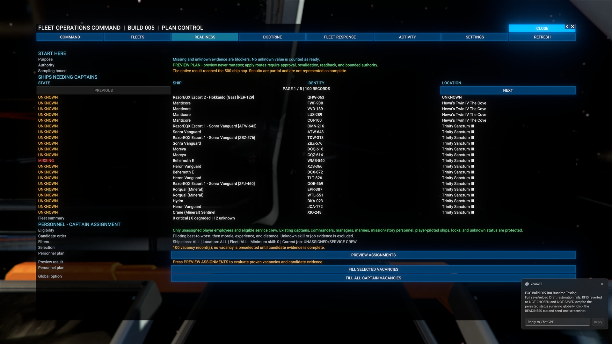

Readiness separates proven captain vacancies from incomplete evidence.

- **MISSING** means FOC proved that the ship can take a pilot and currently has none.
- **UNKNOWN** means the evidence was incomplete. FOC will not use it as permission to move anyone.

### What to do

1. Read the **SHIPS NEEDING CAPTAINS** list.
2. Note the ship name, stable identity code, and location.
3. Read unknown evidence separately.
4. Select **OPEN TRAINING ACADEMY** when you want to fill a proven vacancy.

A fleet can appear structurally complete but remain unable to act when one required ship has no captain.

---

## 11. TRAINING ACADEMY - Pilots, Marines, and captains

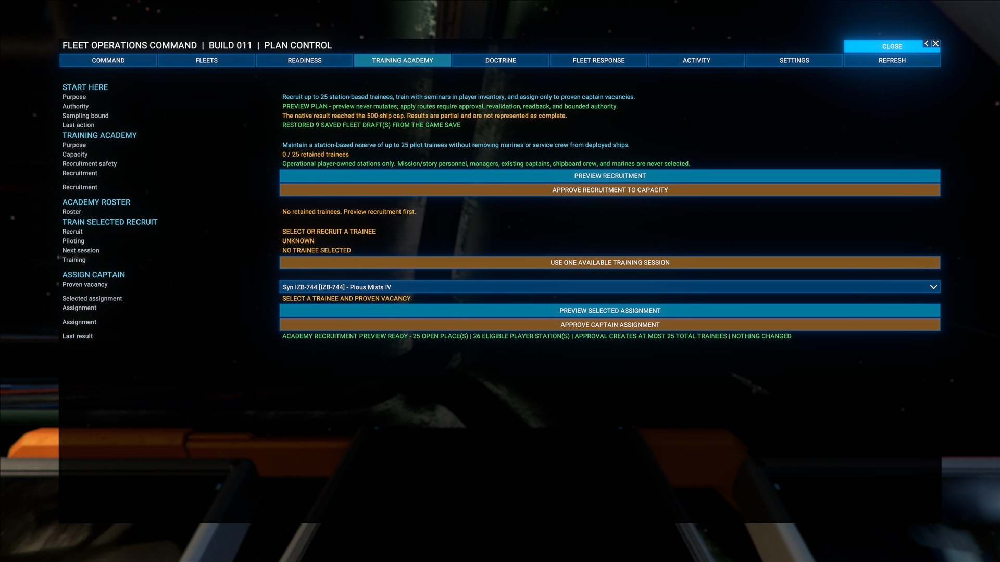

### The shared roster

The Academy keeps one station-based reserve of no more than 25 trainees. Every retained trainee may receive Pilot or Marine training and then be assigned under the selected focus.

FOC never takes managers, existing captains, mission/story people, or deployed shipboard crew for recruitment.

### Recruit one trainee

1. Choose **PILOT** or **MARINE** focus.
2. Select **PREVIEW RECRUITMENT**.
3. Read the eligible-station and capacity result.
4. Select **APPROVE ONE TRAINEE** only when the preview is correct.
5. Wait for roster readback.

### Train one session

1. Choose a trainee.
2. Read the current skill, maximum rank, and required supply.
3. Select **TRAIN ONE SESSION**.
4. Wait for both skill and inventory readback.

One click consumes at most one correct training supply.

### Assign a Pilot as captain

1. Select **PILOT** focus.
2. Choose one trainee and one proven captain vacancy.
3. Preview the exact pair.
4. Select **TRANSFER PILOT TO CAPTAIN POST**.
5. Wait for native assigned-pilot readback.

### Assign a Marine

1. Select **MARINE** focus.
2. Choose one trainee and one eligible destination ship.
3. Preview the exact pair.
4. Approve the transfer.
5. Wait for native Marine role and destination readback.

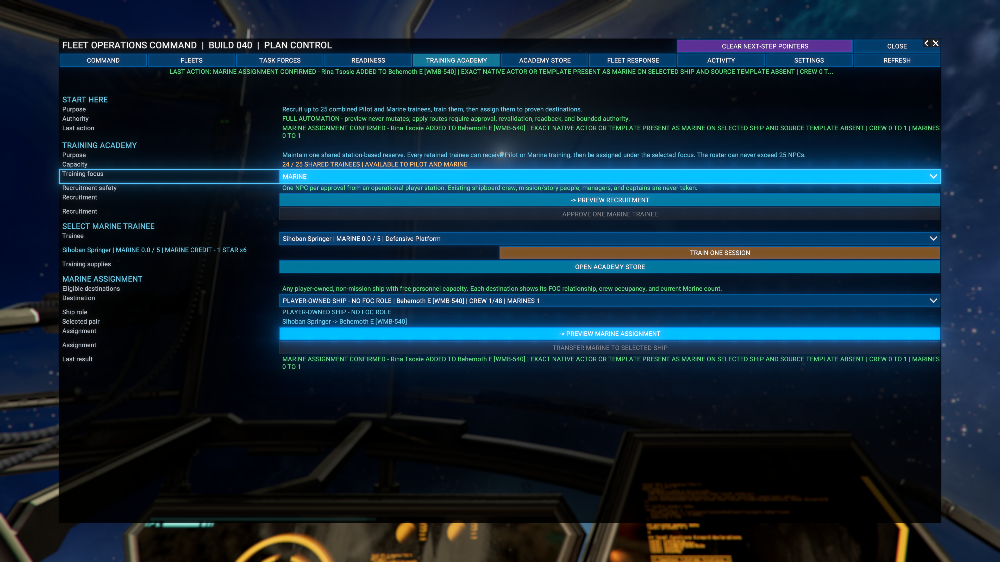

### Captain auto-fill

Preview before approval. FOC revalidates up to 25 proven vacancies, retained Pilot trainees, Academy capacity, eligible player stations, and complete seminar inventory. It recruits only missing trainees, trains selected Pilots to the required level, assigns each to a still-vacant ship, and reports requested, recruited, assigned, and blocked counts.

No existing captain or shipboard crew is taken.

---

## 12. ACADEMY STORE - buy training supplies

Open **ACADEMY STORE** when training is blocked by missing supplies.

1. Review the current inventory and available purchase.
2. Preview the purchase.
3. Read the quantity and credit cost.
4. Approve only the purchase you understand.
5. Wait for credit and inventory readback.
6. Return to **TRAINING ACADEMY** and refresh.

The Store is a player-approved spending action. Opening the page, refreshing, or previewing does not spend credits.

---

## 13. FLEET RESPONSE - answer one fresh distress call

Fleet Response checks whether one ready fleet may answer a recent attack. It considers ownership, urgency, damage, distance, captain, readiness, player control, story protection, response locks, current orders, and incident age.

FOC sizes the response to the observed attacker. It classifies a known attacker as **XS**, **S**, **M**, **L**, **XL**, or **UNKNOWN** and requires at least 1, 1, 3, 6, 10, or 1 ready ships respectively. Among fleets that pass every gate, it prefers the smallest adequate fleet before distance and saved priority. UNKNOWN never means harmless; it uses the conservative implemented fallback and remains visible in the evidence.

### What to do

1. Start and arm an eligible fleet on **FLEETS**.
2. Wait for a real attack on an allowed player ship or station.
3. Open **FLEET RESPONSE**.
4. Confirm the victim, attacker, selected fleet, and response rules.
5. Preview the dispatch.
6. Approve one dispatch when eligible.
7. Wait for X4's native Attack-order readback.
8. Open **ACTIVITY**.

### Flood protection

Repeated reports from the same current attacker are grouped into one incident. FOC selects one closest eligible fleet and attempts one uniquely named native Attack order. The incident and responding fleet stay locked until the quiet/recovery rule is satisfied or a required object no longer exists.

Do not keep pressing Approve while an action is pending.

---

## 14. ACTIVITY - read the proof trail

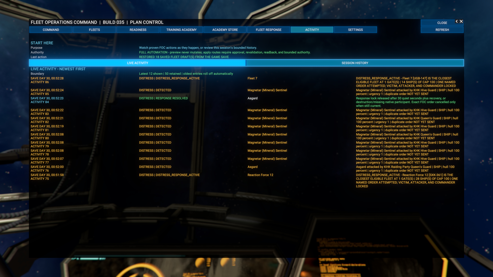

Activity shows the newest bounded actions and saved session history. It is the first place to look when a button seems to do nothing.

Entries can show:

- the request and stable subject;
- whether an attack was detected, grouped, dispatched, resolved, or blocked;
- which fleet was selected and why;
- whether one native order was attempted;
- repair, rebuild, training, Store, and story-protection results; and
- what X4 returned.

FOC suppresses repeated locked-incident noise from the visible feed while preserving meaningful transitions. A new incident, first red-damage transition, dispatch, resolution, failure, or changed outcome still appears. Repeated observations that cannot create another order do not consume the newest rows simply to say that the duplicate was suppressed.

### After-action reports

When a response incident resolves, FOC stores a bounded report with the known victim, attacker, responding fleet, start and finish times, outcome, losses, and damage. Open the report area from **ACTIVITY** to review the newest completed incidents. FOC retains no more than 50 reports. If X4 did not provide enough evidence, the field says **UNKNOWN** instead of inventing a result.

Ordinary distress entries are amber. Damage and positively lost-ship rebuild events can be red. Confirmed actions and releases are green.

Read the newest entry literally. Correct only the named problem. If a green result disagrees with the real X4 state, stop and report it as a bug.

---

## 15. SETTINGS - decide how much authority FOC has

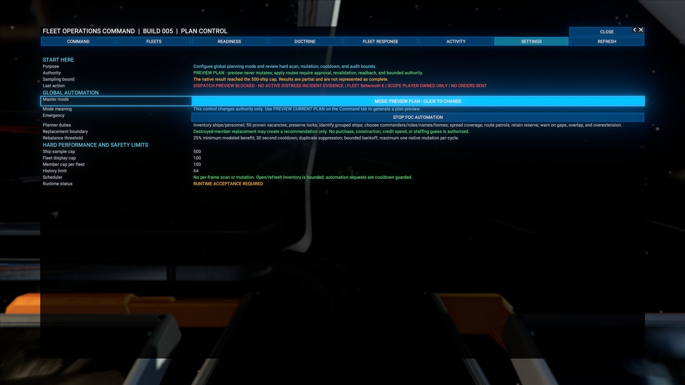

Keep **PREVIEW PLAN** until you have:

1. started one fleet from **FLEETS**;
2. confirmed its movement in X4;
3. seen correct native readback in **ACTIVITY**; and
4. tested one manual distress response.

Use **APPLY APPROVED PLAN** when you want Command to apply eligible saved plans. Use **FULL AUTOMATION** only when you want bounded automatic distress dispatch.

### Readiness policy

FOC lets you set four fleet-readiness gates:

- minimum commander hull;
- minimum fleet hull;
- required captain coverage; and
- maximum fleet size.

These gates apply at the mutation boundary, not just while the page is drawn. Tight values can deliberately block patrol launch, response, or Task Force rotation. Relax a gate only after reading which fleet failed it.

### Emergency retreat

Emergency Retreat is optional and off until the player enables it. For an enrolled active fleet below the saved retreat hull threshold, FOC may issue X4's native **Flee** order from the exact observed attacker. It still blocks story or mission ships, player-controlled ships, missing pilots, critical non-cancelable orders, and duplicate retreats. Cargo dropping is disabled. The saved return behavior determines what happens after the retreat condition clears.

### Templates and presets

You may save up to eight reusable fleet templates. The six plain-language presets and saved templates populate visible draft settings only. Applying one does not send an order, rotate a Task Force, enable automation, spend credits, or change X4's story. Review the populated fields and use the normal approval button when you actually want a mutation.

### Important bounds

- Fleet discovery examines no more than 500 top-level candidates per structural snapshot.
- Up to 100 fleets and 100 members per fleet are displayed.
- Global saved-plan application handles no more than 100 Draft records.
- Academy bulk assignment handles no more than 25 exact pairs per approval.
- Live Activity retains 50 rows and displays the newest 12.
- Full Automation uses one 30-second scheduler and attempts at most one eligible response per cycle.

A visible cap means the result is bounded. It does not mean an unseen object is safe.

---

## 16. Advanced Fleet Controls

Select **SHOW ADVANCED CONTROLS** only when you need additional fleet state and manual controls.

Advanced controls can preview current saved state, save without sending, lock or unlock the selected fleet, preserve or replace eligible orders, and expose more readback details.

### Native subordinate-group policies

FOC exposes four real X4 subordinate-group switches for each current direct group:

- dock with the commander;
- resupply at the fleet;
- respond to X4 distress calls; and
- reinforce the fleet through X4's normal construction and resource rules.

Preview the exact groups first. Approval captures the pre-change value, changes the native policy, and immediately reads it back. If any group mismatches, FOC blocks the transaction and attempts an atomic rollback to every captured value. A **ROLLBACK CONFIRMED** result means all captured values were restored. **ROLLBACK UNKNOWN** means you must inspect the groups in X4 before continuing.

The docking option is the roadmap feature requested by players who want escort fighters to land when their commander docks. It operates through X4's implemented group policy; it does not teleport ships, create docking capacity, or bypass a station or carrier's normal docking rules.

These switches do not create a patrol route. The Operations Map's colored route strokes are historical evidence overlays only; they never become ship orders. FOC sends only behavior backed by implemented native X4 orders.

> **Important:** A saved fleet Draft is not proof that a patrol is active. Look for **PATROL ACTIVE** and confirm the real X4 order.

---

## 17. Confirm behavior in X4

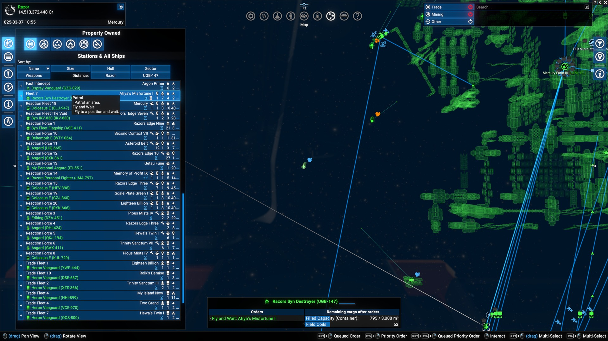

FOC's readback matters, but also check the game world:

1. Open the ordinary X4 map. This is separate from FOC's Historical Intelligence Map.
2. Select the fleet commander.
3. Check current and default behavior.
4. Watch the fleet begin moving.
5. Confirm escorts remain assigned.
6. Check **READINESS** if one escort does not move.
7. Check **ACTIVITY** after a distress response, repair handoff, assignment, or rebuild.

Old or removed mods can leave malformed ship or crew state. FOC blocks uncertain state instead of guessing.

---

## 18. Troubleshooting

### Carrier threshold and saved profile disagree

Read **Saved wing** and **Editor**, not just the dropdown. A changed dropdown is a draft until Apply succeeds. Confirm the carrier ID and group. Use the native-map inspection button to check actual assignments; do not repeatedly Apply to hide a discrepancy. Include both rows in a bug-report screenshot.

### FOC does not appear

- Confirm the extension is enabled.
- Confirm a manual path ends in `extensions/jk_foc/content.xml`.
- Dock, close the interaction menu, and open it again.
- Check whether another UI mod replaces the docked interaction menu.

### A fleet is missing

- Confirm it is a player-owned top-level combat commander.
- Confirm it has at least one living combat subordinate.
- Station guards and station-commanded ships are excluded.
- Cargo, mining, trade, and other non-combat commanders are excluded from the combat list.
- Check both fleet-list pages.

### My fleet will not start

- Does the commander have a captain?
- Does the fleet have a Home point?
- Are you personally controlling the commander?
- Is one member still protected by a story or mission?
- Is there a critical order that cannot be cancelled safely?
- Read the exact blocker above the Send button.

### FOC says a finished story ship is protected

Read the exact ship name and question. Choose **NO - LET FOC CONTROL IT** only when you know that ship is no longer being used by a story or mission. Your answer changes FOC only.

### A repair or rebuild is unavailable

- Refresh native readback.
- Confirm the ship is eligible and not protected.
- For repairs, let X4 calculate the real price and resources.
- For rebuilds, confirm the exact blueprint is owned.
- Confirm a compatible player-owned yard can build the saved hull and loadout.
- Confirm no living ship or duplicate build already represents that loss.

### An action stays pending

Do not click repeatedly. Wait, refresh once, and inspect **ACTIVITY**. If no result appears, preserve a screenshot and the relevant X4 debug log.

### The Operations Map shows no colored route

- Confirm **PIRATE ACTIVITY** or **HEAVY PATROL ROUTES** is selected instead of **OVERVIEW**.
- Move over a known sector and read **FILTER EVIDENCE**.
- A pirate line requires a retained, positively identified pirate attack observation on a player-owned asset.
- A patrol line requires an observed adjacent-gate crossing by an enrolled fleet commander.
- Evidence outside the active observation window is intentionally excluded.
- No colored line means no qualifying retained evidence. It does not mean the route is safe.

### The Operations Map will not mark Home

- Open it from the selected fleet's **CHOOSE HOME POINT ON MAP** button so FOC enters request-scoped mark mode.
- Use a short left-click on a player-known sector cell. Do not right-click.
- If the map pans, release the drag and click the exact point without moving the mouse.
- **Escape** cancels and returns no location.
- After FOC returns, verify the fleet name, sector, and X/Y/Z coordinates before sending.

### The result and the game disagree

Treat that as a bug. Record the fleet, ship, button, visible FOC result, real X4 state, approximate time, and any older mod that changed the object.

Report issues at [github.com/razoreqx1/FOC/issues](https://github.com/razoreqx1/FOC/issues).

---

## 19. Quick command card

### Start one patrol

`FLEETS -> select fleet -> answer any story question -> choose Home -> set response rules -> SEND THIS FLEET ON PATROL -> wait for PATROL ACTIVE -> ACTIVITY`

### Inspect historical sector intelligence

`OPERATIONS MAP -> hover a known sector -> read FILTER EVIDENCE and RISK -> choose PIRATE ACTIVITY or HEAVY PATROL ROUTES -> inspect yellow / amber / red evidence routes -> BACK TO FOC`

### Mark an exact Fleet Home

`FLEETS -> select fleet -> CHOOSE HOME POINT ON MAP -> pan or zoom -> short left-click exact known point -> confirm returned sector and X/Y/Z -> send only when ready`

### Find one fleet quickly

`FLEETS -> FLEET FINDER -> choose a letter or ALL FLEETS -> select the fleet -> read the pinned LAST ACTION result`

### Fill one captain vacancy

`READINESS -> TRAINING ACADEMY -> PILOT -> choose trainee and vacancy -> PREVIEW -> TRANSFER PILOT TO CAPTAIN POST -> REFRESH`

### Assign a Marine

`TRAINING ACADEMY -> MARINE -> choose trainee and ship -> PREVIEW -> APPROVE TRANSFER -> ACTIVITY`

### Repair a damaged fleet ship

`FLEETS -> REPAIR / REPLACE / REBUILD -> select damaged ship -> native Repair / Upgrade -> review X4 cost -> confirm in X4`

### Review or rebuild a lost ship

`FLEETS -> REPAIR / REPLACE / REBUILD -> refresh -> review exact lost record -> PREVIEW -> approve eligible rebuild -> refresh for readback`

### Answer one distress call

`FLEETS -> arm eligible fleet -> fresh attack -> FLEET RESPONSE -> PREVIEW -> APPROVE ONE DISPATCH -> ACTIVITY`

### Create and rotate a Task Force

`STRATEGIC OPS -> TASK FORCES -> CREATE -> add fleets -> choose ACTIVE and RESERVE -> save -> preview rotation -> ROTATE -> verify both commanders in X4`

### Make escorts dock with their commander

`FLEETS -> select fleet -> SHOW ADVANCED CONTROLS -> preview group policies -> enable DOCK WITH COMMANDER -> approve -> read native readback`

### Stop automation

`COMMAND or SETTINGS -> STOP FOC AUTOMATION -> wait for confirmation -> ACTIVITY`

### Hide or restore workflow hints

`CLEAR NEXT-STEP POINTERS -> work without arrows -> SHOW NEXT-STEP POINTERS when you want guidance again`

---

## 20. Getting help

Before reporting a problem, take a screenshot of the complete FOC page and write down what the affected ship is actually doing in X4. Include the visible result, fleet name, ship name, action, approximate time, and whether another mod changed that ship.

- Steam Workshop: <https://steamcommunity.com/sharedfiles/filedetails/?id=3793624775>
- Project and issues: <https://github.com/razoreqx1/FOC>

---

**FOC watches. You command.**

## 21. Session History and live map inspection (v1.55)

Open **Activity -> Session History** to browse the latest 50 saved operational events, including yellow distress alerts and red damage events. This uses the same retained event archive as Live Activity, rather than diagnostic refresh summaries. Detection, response, and resolution are distinct events.

Select **Refresh** to retrieve current retained events. Repeated refreshes do not duplicate event IDs; incomplete updates do not replace a complete list. Older pages retain their current window while new events arrive. Return to page one to see the newest entries.

New distress detections record the exact subject and sector. Select an available history map button to open the live native X4 map on that subject. If the subject no longer exists, its recorded sector opens when available. This is current live inspection, not a replay or a guaranteed battle position. Older records without stored identity remain readable, with map navigation disabled. Use native Back to return to the history view.

Opening the map does not send orders, apply profiles, or spend credits. Existing native repair controls are unchanged; fully automatic Repair and Return is not included in this update.
